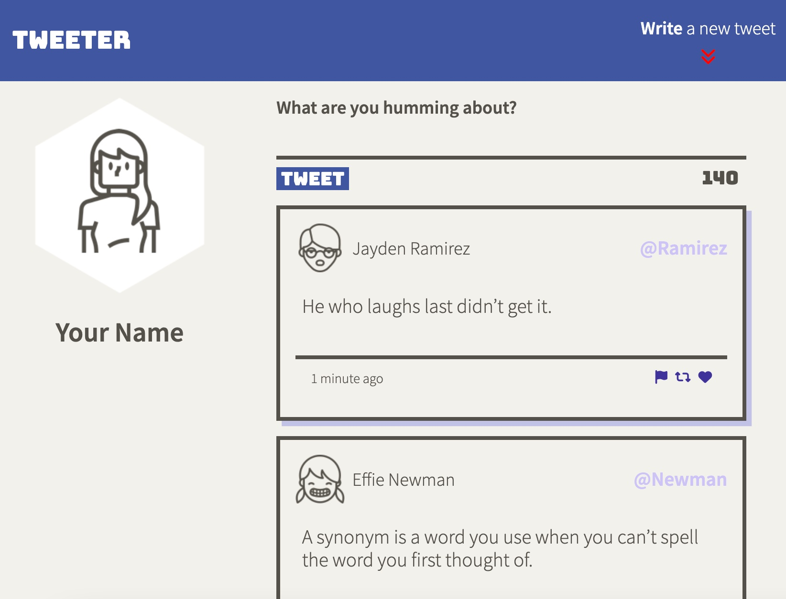
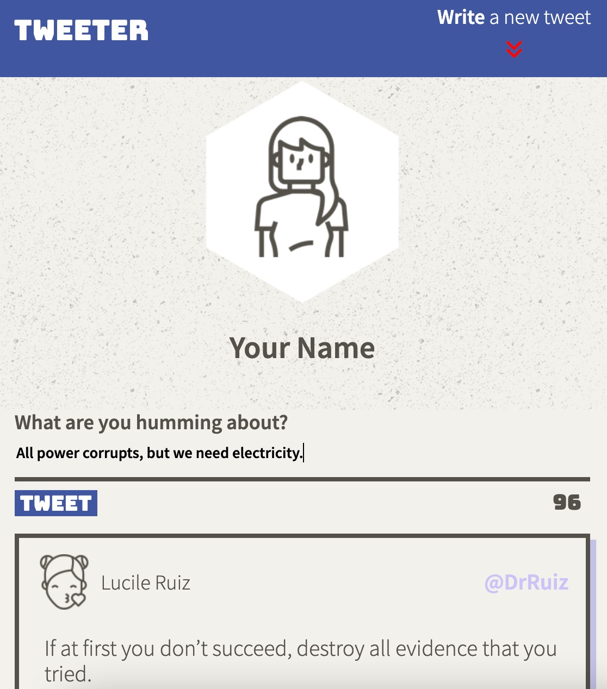
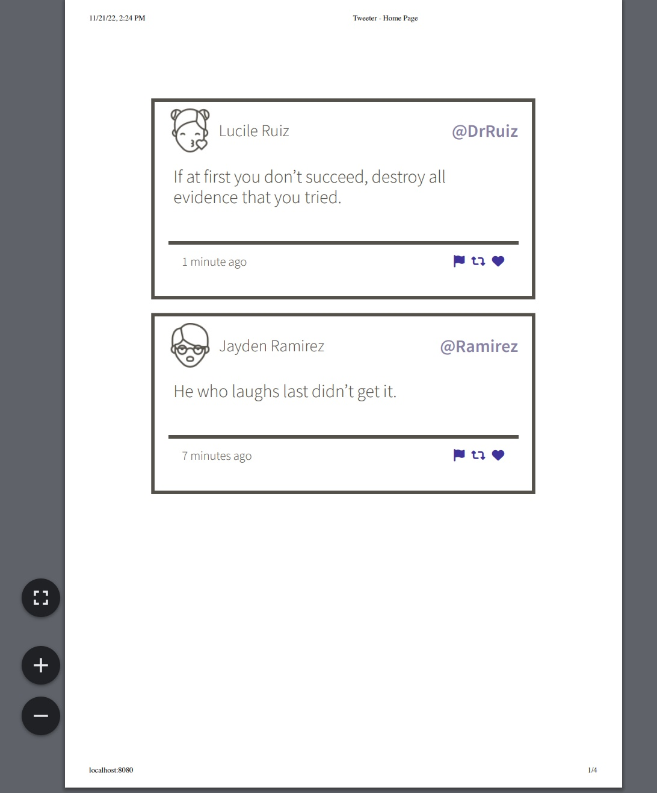

# Tweeter Project

Tweeter is a simple, single-page Twitter clone.

This repository is the starter code for the project: Students will fork and clone this repository, then build upon it to practice their HTML, CSS, JS, jQuery and AJAX front-end skills, and their Node, Express back-end skills.

## Purpose

This project is part of my learnings at Lighthouse Labs.

## Final Product

- This submission has been tested with Chrome, Firefox and Safari browsers and should fulfill all of the functional requirements of the Tweeter assignment as well as including all of the stretch features.

- The only deviation from the original requirements is that a validation error message will be cleared when the user clicks back into the 'New Tweet' textarea (public/scripts/client.js lines 102-106).  I found this to give a better experience than it remaining in view while the user is editing the tweet.  As per the requirements, it also disappears if the 'Submit Tweet' button is clicked again and slides back in to view if the error remains.

Screenshot of the 'Desktop Style', with the user profile and tweets side-by-side :

Screenshot of the default view for smaller screens, all information is contained in one column :

Screenshot of the print preview style, only the tweets themselves will be printed :

## Getting Started

1. [Create](https://docs.github.com/en/repositories/creating-and-managing-repositories/creating-a-repository-from-a-template) a new repository using this repository as a template.
2. Clone your repository onto your local device.
3. Install dependencies using the `npm install` command.
3. Start the web server using the `npm run local` command. The app will be served at <http://localhost:8080/>.
4. Go to <http://localhost:8080/> in your browser.

## Dependencies

- Express
- Node 5.10.x or above
- body-parser
- chance
- express
- md5
- normalize.css

## Dev Dependencies

- nodemon

## Documentation

The following files have been developed in addition to the base code for the project:

- `public/index.html`: the container for the single-page app, contains the structure of the user interface.

- `public/scripts/client.js` : the principal file concerning client-side JavaScript logic. Contains functionality for creating, loading and displaying tweets, as well as the validation error display if a tweet is too long or the user is submitting an empty tweet.

- `public/scripts/composer-char-counter.js` : updates the 'characters remaining' counter as a new tweet is composed, listening for any 'input' in the 'new tweet' textarea.

- `public/scripts/composer.js` : controls the scrolling to the top of the page with focus in the 'new tweet' textarea when either the 'Write a New Tweet' or 'Back to Top' buttons are clicked.  Also hides the 'Back to Top' button when user is at the top of the page.